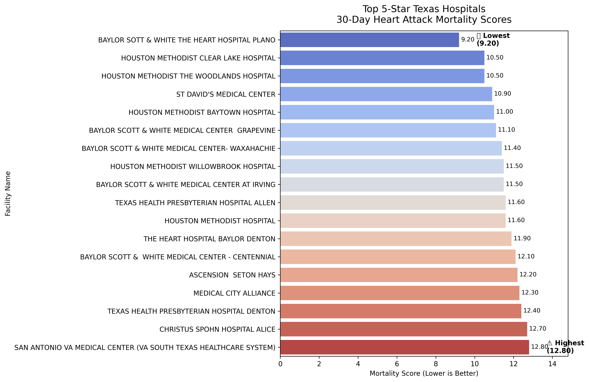

<<<<<<< HEAD
Hospital Safety & Clinical Performance Benchmarking
=======
# Hospital Safety & Clinical Performance Benchmarking
>>>>>>> ea604a6 (Finalized README with correct Markdown formatting)

This project provides an end-to-end data engineering and analytics pipeline to evaluate healthcare quality across Texas. Using CMS (Centers for Medicare & Medicaid Services) datasets, the pipeline extracts, cleans, and analyzes hospital performance to identify top-rated facilities for acute clinical care.

## 🚀 Project Overview
* **Objective**: Benchmark 5-star hospitals in Texas based on 30-day mortality rates for heart attack (AMI) patients.
* **Data Source**: CMS Hospital General Information and Safety Score datasets (22MB+).
* **Key Results**: Successfully identified and visualized the top-performing clinical facilities using standardized safety benchmarks.

<<<<<<< HEAD
Data Source: CMS Hospital General Information and Safety Score datasets (22MB+).
Key Results: Successfully identified and visualized the top-performing clinical facilities using standardized safety benchmarks.

🛠️ Technical Stack
Language: Python 3.x (Pandas, Matplotlib, Seaborn).
Database: MySQL (Relational Schema Design & SQL Analysis).
Tools: VS Code, Git/GitHub for version control.

📂 Project Structure
data/: Raw and cleaned CSV files.
scripts/: Python ETL (data_cleaning.py) and Visualization (Hospital_Visualization.py) scripts.
sql/: SQL scripts for database creation and clinical benchmarking queries.

📈 Key Insights
The following visualization showcases the top-performing 5-star hospitals in Texas. Lower mortality scores indicate better clinical outcomes.
🔧 Challenges & Solutions
Schema Mapping: Resolved discrepancies between datasets (e.g., Facility Name vs. Hospital Name) using SQL joins.
Data Integrity: Implemented a Python cleaning script to handle "Not Available" entries and ensure numeric consistency for clinical scores.
Path Management: Resolved environment-specific pathing issues in VS Code to ensure a modular, reproducible project structure.
=======
## 🛠️ Technical Stack
* **Language**: Python 3.x (Pandas, Matplotlib, Seaborn).
* **Database**: MySQL (Relational Schema Design & SQL Analysis).
* **Tools**: VS Code, Git/GitHub for version control.

## 📂 Project Structure
* `data/`: Raw and cleaned CSV files.
* `scripts/`: Python ETL (`data_cleaning.py`) and Visualization (`Hospital_Visualization.py`) scripts.
* `sql/`: SQL scripts for database creation and clinical benchmarking queries.

## 📈 Key Insights
The following visualization showcases the top-performing 5-star hospitals in Texas. Lower mortality scores indicate better clinical outcomes.

## 🔧 Challenges & Solutions
* **Schema Mapping**: Resolved discrepancies between datasets (e.g., `Facility Name` vs. `Hospital Name`) using SQL joins.
* **Data Integrity**: Implemented a Python cleaning script to handle "Not Available" entries and ensure numeric consistency for clinical scores.
* **Path Management**: Resolved environment-specific pathing issues in VS Code to ensure a modular, reproducible project structure.
>>>>>>> ea604a6 (Finalized README with correct Markdown formatting)
